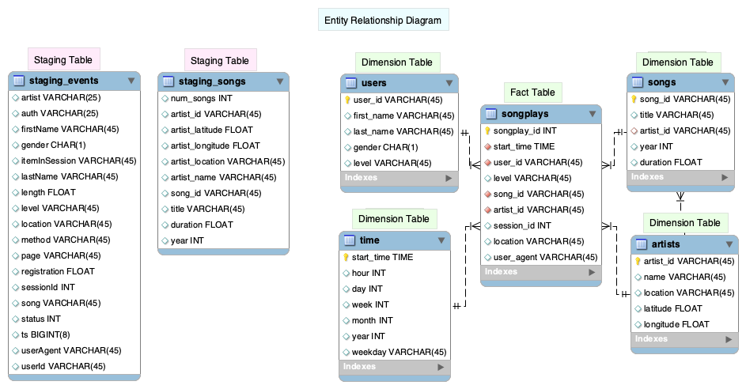

# Data Warehouse ETL Pipeline Implementation (AWS S3 -> Redshift)

## Summary

This project is an ETL process built for a music streamming company moving data to cloud with efficient structure for analytics purposes. The company finished loading their data to AWS S3 storage folders. The project will handle extracting data from file folders (a serial of JSON files) and load into an AWS Redshift cluster. In this process, we first created staging tables to hold all the data copied from S3. Then we designed a new data warehouse structure with fact and demension tables to store original/tranformed data. 

## Data Source

There are two types of data related to this project: 

* **Song** Dataset:  
    A subset of real data from the [Million Song Dataset](http://millionsongdataset.com/). Each file is in JSON format and contains metadata about a song and the artist of that song. The files are partitioned by the first three letters of each song's track ID. For example, here are filepaths to two files in this dataset.

        song_data/A/B/C/TRABCEI128F424C983.json
        song_data/A/A/B/TRAABJL12903CDCF1A.json

    Inside each JSON file, data has following structure: 
        
        {
          "num_songs": 1,
          "artist_id": "ARJIE2Y1187B994AB7",
          "artist_latitude": null,
          "artist_longitude": null,
          "artist_location": "",
          "artist_name": "Line Renaud",
          "song_id": "SOUPIRU12A6D4FA1E1",
          "title": "Der Kleine Dompfaff",
          "duration": 152.92036,
          "year": 0
        }
 

* **Log** Dataset:  
    For illustration purpose, the second dataset consists of log files in JSON format generated by this [event simulator](https://github.com/Interana/eventsim) based on the songs in the dataset above. These simulate app activity logs from an imaginary music streaming app based on configuration settings.

    Fore each log data file path, it was partitioned by year, month, date like following:

        log_data/2018/11/2018-11-12-events.json
        log_data/2018/11/2018-11-13-events.json

    Example of data format for each log file: 
    JSON view:
    
        {
            "artist": null,
            "auth": "Logged In",
            "firstName": "Walter",
            "gender": "M",
            "itemInSession": 0,
            "lastName": "Frye",
            "length": null,
            "level": "free",
            "location": "San Francisco-Oakland-Hayward, CA",
            "method": "GET",
            "page": "Home",
            "registration": 1540919166796.0,
            "sessionId": 38,
            "song": null,
            "status": 200,
            "ts": 1541105830796,
            "userAgent": "\"Mozilla/5.0 (Macintosh; Intel Mac OS X 10_9_4) AppleWebKit/537.36 (KHTML, like Gecko) Chrome/36.0.1985.143 Safari/537.36\"",
            "userId": "39"
        }
            
    Tablar view with top lines:  
   
   

## Data Warehouse Table Design 

We plan to create a database include staging tables without any keys and a star schema with fact and dimension tables and relationships.

* Redshift Cluster Database Entity Diagram: tables marked in different colors to differentiate staging tables from star schema tables.

 

* Table Creation:
    * sql_queries.py: includes all table creation and loading script
    * Distribution and Sort Keys are added in fact and dimension tables. 
        * The distribution key is set in songplays (Fact) table (song_id column). 
        * The sort keys are set as each dimension table's primary key for easy join. 
        * In songplays table, sort key are composed of 4 foreign keys.

## ETL Process
* Load data to staging tables: after table creation, we are ready to load data. Here we use COPY command loading data from S3 file folders to staging tables.
    * when loading data to staging tables, I got a few errors using COPY command. In that case, the command line window only tells some error(s) happened and you will need use the query tool on Redshift webpage to query the error details in stl_load_error system table.
    
    Error message looks like:
    
        Load into table 'staging_events' failed.  Check 'stl_load_errors' system table for details.
        
    The Two error I got: 
    
        1. "Invalid digit, Value 'S', Pos 0, Type: Integer". This error get fixed by change the related column data type to VARCHAR
        1. "Delimiter not found". This error was fixed by adding a parameter "json 'auto'" at the end of Copy command.
* Load data into star schema:
    Use sql queries
    * Users and Time tables: records are inserted from staging_events table.
    * Songs and Artists tables: data are inserted from staging_songs table.
    * Songplays table: records are inserted by joining staging_events and staging_songs table.

## Set up and running 

1. Create [IAM role](https://console.aws.amazon.com/iam/home#/roles) for using redshift service and attach policy to get S3 read only permission. 
1. Create [Redshift cluster](https://console.aws.amazon.com/redshift/) with PostgreSQL database.
1. Fill in real information in dwh.cfg file, here a template file is provided.
1. Run create_table.py
1. Run etl.py

    
   
   

